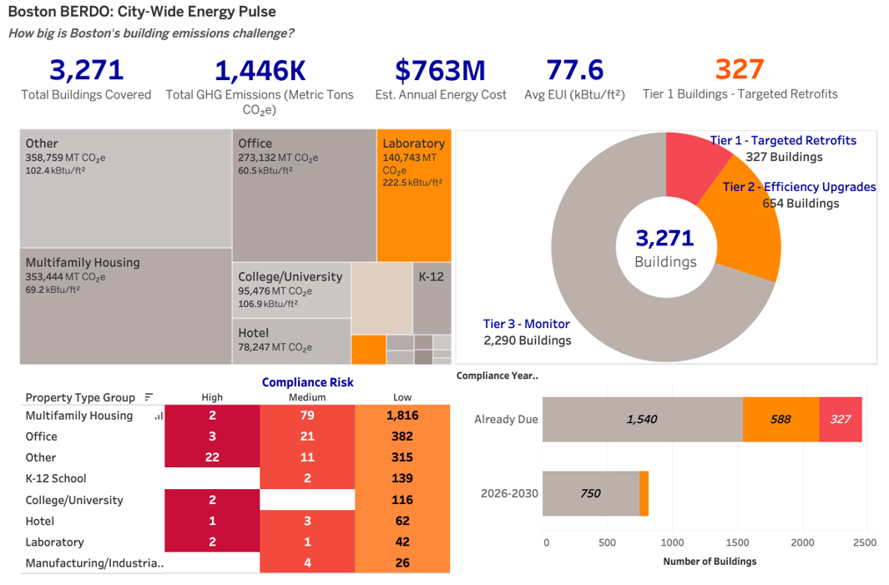
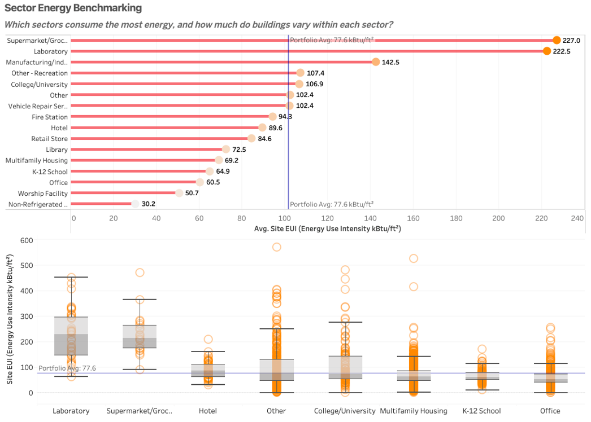
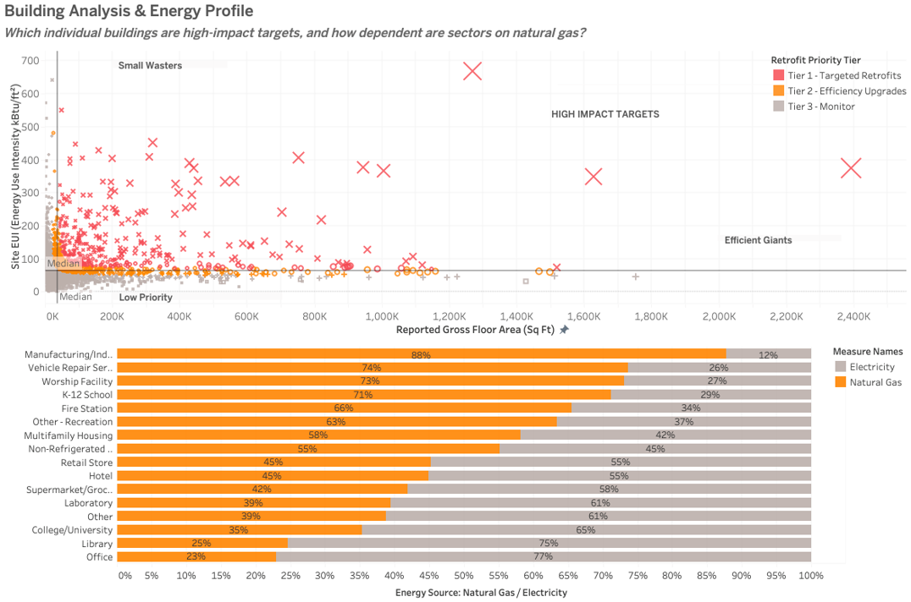
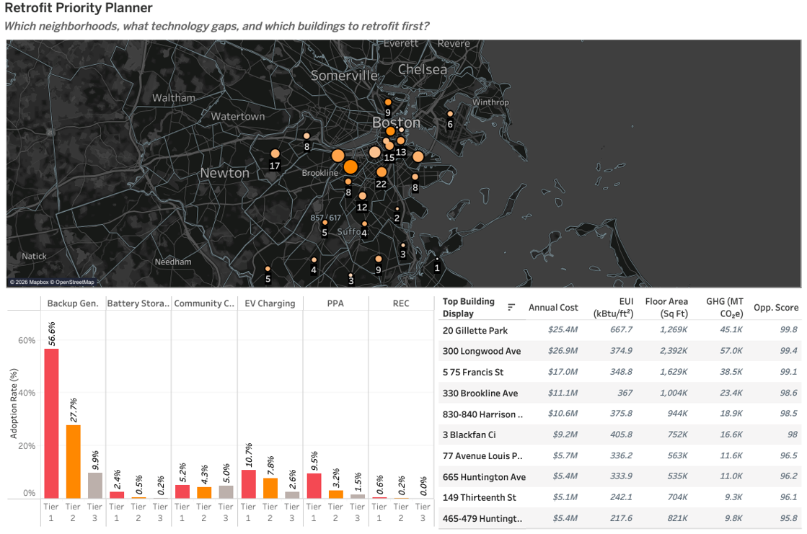

# Boston BERDO Retrofit Prioritization Dashboard

## Overview

This project analyzes Boston's Building Emissions Reduction and Disclosure Ordinance (BERDO) data to identify and prioritize high-impact building retrofit opportunities.

Using building-level energy and emissions data, our team developed a Tableau dashboard system that moves from a city-wide overview to sector benchmarking, individual building analysis, and an actionable retrofit priority plan.

This was completed as a team project for an Information Visualization & Dashboard Design course.

## Business Question

Which Boston buildings should be prioritized for energy retrofits to achieve the greatest reduction in emissions and identify the highest-impact opportunities?

## Data

The analysis used 2025 BERDO reporting data covering:

- **3,271 buildings**
- **29 building, energy, emissions, and compliance attributes**
- 16 property types
- Energy use intensity (EUI)
- Greenhouse gas emissions
- Natural gas and electricity consumption
- Building size and Energy Star performance
- Compliance status and green technology adoption

The data was cleaned and prepared in Python before being connected to Tableau for analysis.

## Methodology

We developed an **Opportunity Score** from 0–100 using:

- Site Energy Use Intensity (EUI)
- Emissions intensity
- Building floor area
- Energy Star performance

Buildings were then classified into three retrofit priority tiers:

- **Tier 1 — Targeted Retrofits:** Top 10% (327 buildings)
- **Tier 2 — Efficiency Upgrades:** Next 20% (654 buildings)
- **Tier 3 — Monitor:** Remaining 70% (2,290 buildings)

K-means clustering was also used to compare the prioritization framework with patterns naturally present in the data.

## Dashboard 1 — City-Wide Energy Pulse

Provides a high-level view of Boston's building emissions challenge, including total emissions, estimated energy costs, retrofit tiers, sector emissions, and compliance risk.

## Dashboard 2 — Sector Energy Benchmarking

Compares energy intensity across property types and highlights variation within sectors that can be hidden by averages.

## Dashboard 3 — Building Analysis & Energy Profile

Identifies individual high-impact buildings using floor area and energy intensity while also examining each sector's dependence on natural gas versus electricity.

## Dashboard 4 — Retrofit Priority Planner

Turns the analysis into an actionable prioritization tool by showing geographic concentrations of Tier 1 buildings, green technology adoption, and the highest-priority individual retrofit targets.

## Key Findings

- **327 buildings** were classified as Tier 1 retrofit targets.
- All Tier 1 buildings had already passed their compliance deadline.
- Laboratories and supermarkets had energy intensity nearly 3x the portfolio average.
- Some multifamily buildings exceeded 450 kBtu/ft² despite a much lower sector average.
- **48% of Tier 1 buildings** were concentrated in five Boston ZIP codes.
- High green-technology adoption did not necessarily correspond with strong building efficiency, highlighting the importance of structural retrofits.

## Project Files

- `berdo-dashboard.twbx` — packaged Tableau workbook
- `final-report.pdf` — project methodology, analysis, and findings
- `final-presentation.pptx` — final team presentation
- Dashboard PNGs — portfolio-ready views of the four Tableau dashboards

## Tools

**Tableau** | Python | Data Cleaning | Data Visualization | Dashboard Design | K-Means Clustering | KPI Development
